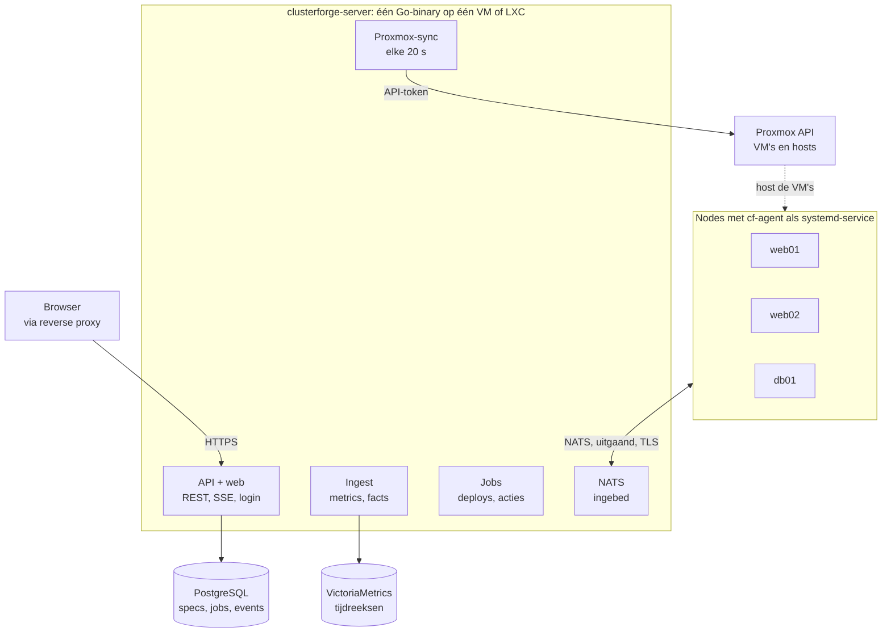

# ClusterForge – Technisch ontwerp MVP fase 1

Stand: 2026-10-05 · Bron: [Claude Doc](https://claude.ai/code/artifact/4ecc23f3-3992-4cd6-86ba-6bfb14e9cdc5)

## Samenvatting

ClusterForge fase 1 wordt één Go-binary (API, jobs, ingebedde NATS, webinterface) plus PostgreSQL en VictoriaMetrics, met een kleine Go-agent op elke node. Dat is het kleinste geheel dat een eenmansproject kan bouwen, deployen en onderhouden, en het blijft open voor fase 2 en 3.

De MVP levert wat fase 1 afbakent: login, cluster- en node-inventory, Proxmox-integratie, monitoringdashboard, templates, clusterdeployment en de agent.

**Uitgangspunten**

- **Modulaire monoliet, geen microservices.** Eén proces met duidelijke interne pakketten. Opsplitsen kan later, samenvoegen is duur.
- **De agent is de enige weg naar de node.** Geen SSH vanuit de server; de agent maakt zelf een uitgaande verbinding naar NATS.
- **Getypte commando's, geen vrije shell.** De agent voert alleen bekende acties uit. Dat maakt hem veilig en later audit- en drift-vriendelijk.
- **Gewenste staat als data.** Een cluster is een YAML-spec die in de database staat. Fase 2 (GitOps, drift) leest dan dezelfde spec uit Git en vergelijkt hem met de werkelijkheid.
- **Alles wat verandert is een event.** Vanaf dag één schrijft elke wijziging een regel in een append-only eventtabel. Audit logging, What Broke en de AI-assistent bouwen daarop verder.
- **Bestaande tools hergebruiken.** VictoriaMetrics voor metrics, Grafana voor diepe dashboards, Proxmox voor VM's. ClusterForge is de lijm en het overzicht.

**Buiten scope voor fase 1:** drift detection, GitOps, backup- en failovertests, audit-UI, dependency graph, Vault/SOPS, certificaatbeheer, AI-functies. Het datamodel houdt er wel rekening mee.

## Architectuur

De server is het enige centrale proces: browser, agents en Proxmox praten allemaal met hem, en hij is de enige die PostgreSQL en VictoriaMetrics schrijft. De hele installatie draait als een docker-compose stack op één VM of LXC.



De agents openen zelf een uitgaande verbinding naar NATS, dus op de nodes staat geen poort open; alleen de server praat met PostgreSQL, VictoriaMetrics en Proxmox.

| Component | Wat het doet | Technologie |
| --- | --- | --- |
| clusterforge-server | REST API, login, jobrunner, Proxmox-sync, metrics-ingest, serveert de webinterface | Go, chi, pgx/sqlc, River |
| Ingebedde NATS | Berichtenbus tussen server en agents, met JetStream voor commando's en jobvoortgang | nats-server als library in dezelfde binary |
| Webinterface | Dashboard, inventory, deploy-wizard | Next.js (static export), React, TypeScript, Tailwind, TanStack Query |
| PostgreSQL | Inventory, specs, jobs, events, gebruikers | PostgreSQL 16+ |
| VictoriaMetrics | Tijdreeksen van nodes en clusters | single-node VictoriaMetrics |
| Grafana, Loki | Optioneel: diepe dashboards en logs, vanuit ClusterForge gelinkt | bestaande installatie of in de compose stack |
| cf-agent | Facts, metrics, heartbeat, getypte commando's, deploystappen | Go, statische binary, systemd-service |

**Waarom NATS ingebed.** Een losse NATS-server is nog een ding om te beheren, te upgraden en te beveiligen. Ingebed in de Go-binary heb je één proces en één poort (4222, TLS) die agents moeten bereiken. Groeit het ooit, dan haal je NATS eruit zonder het protocol te wijzigen.

**Waarom de webinterface als static export.** Een beheerdashboard heeft geen server-side rendering nodig. Met `output: 'export'` wordt de frontend een map statische bestanden die de Go-binary via `embed` serveert. Je deployt dan nog altijd één binary, en er is geen Node-proces in productie.

## Datamodel

Het model draait om vier dingen: clusters met hun gewenste staat (spec), nodes met hun waargenomen staat (facts), jobs die de ene naar de andere brengen, en events die alles vastleggen. Alle id's zijn UUID's, alle tijden `timestamptz`, migraties via goose.

| Tabel | Belangrijkste kolommen | Opmerking |
| --- | --- | --- |
| users | id, username, password_hash (argon2id), totp_secret, role, disabled_at | Rollen admin en viewer; owners op clusters verwijzen hierheen |
| sessions | id (random token hash), user_id, expires_at, ip, user_agent | Server-side sessies |
| api_tokens | id, user_id, name, token_hash, scopes, last_used_at | Voor scripts en later een CLI |
| clusters | id, slug, name, description, type, environment (lab, test, prod), template_id, template_version, spec (jsonb), spec_revision, git_repo_url, status, tags (text[]), created_at, updated_at | spec = de volledige YAML-spec als jsonb; spec_revision telt op bij elke wijziging |
| cluster_spec_revisions | cluster_id, revision, spec, source (ui, api, git), created_by, created_at | Historie van de gewenste staat; fase 2 GitOps voegt source git en een commit-sha toe |
| cluster_owners | cluster_id, user_id | Owners per cluster |
| nodes | id, cluster_id (nullable), hostname, role, lifecycle (provisioning, active, maintenance, draining, decommissioned), proxmox_cluster_id, pve_node, vmid, primary_ip (inet), tags | Een node zonder cluster mag: losse servers inventariseren |
| node_addresses | node_id, interface, address (inet), vlan | Basis voor infrastructure mapping in fase 3 |
| vips | id, cluster_id, address (inet), interface, vrid, owner_node_id, owner_since | owner komt uit agent-facts |
| agents | id, node_id, nkey_public, version, enrolled_at, last_seen_at, revoked_at | Een node kan opnieuw enrollen; oude agent wordt revoked |
| enrollment_tokens | id, token_hash, node_id (optioneel), expires_at, used_at | Eenmalig, kort geldig |
| node_facts | node_id, collected_at, os, kernel, docker_version, packages (jsonb), services (jsonb), upgrades (jsonb), raw (jsonb) | Laatste staat per node |
| node_fact_snapshots | node_id, collected_at, hash, facts (jsonb) | Alleen bewaard als de hash verandert; grondstof voor drift en What Broke |
| proxmox_clusters | id, name, api_url, token_id, token_secret (versleuteld), tls_fingerprint, last_sync_at | Meerdere Proxmox-omgevingen mogelijk |
| proxmox_resources | proxmox_cluster_id, type (node, qemu, lxc, storage), pve_id, data (jsonb), synced_at | Cache van /cluster/resources |
| templates | id, name, version, kind, description, schema (jsonb), body (text), source (builtin, git) | Versie is onveranderlijk; een wijziging is een nieuwe versie |
| services | id, cluster_id, node_id, name, kind, depends_on (uuid[]) | In fase 1 gevuld uit templates; fase 2 dependency graph bouwt hierop |
| jobs | id, kind, cluster_id, node_id, status, params (jsonb), requested_by, started_at, finished_at, error | Deploy, VM-actie, node-actie |
| job_steps | job_id, seq, name, status, started_at, finished_at, output (jsonb) | Hervatbaar per stap |
| events | id (bigserial), ts, actor_type (user, agent, system), actor_id, subject_type, subject_id, cluster_id, action, payload (jsonb) | Append-only; alles wat verandert |
| secrets | id, scope, name, ciphertext, key_id | AES-GCM met een masterkey uit de omgeving; fase 2 voegt Vault en SOPS toe als backend |

**Wat dit voorbereidt voor fase 2 en 3**

- Drift detection vergelijkt `clusters.spec` (gewenst) met `node_facts` (werkelijk); de snapshots geven de geschiedenis.
- GitOps schrijft nieuwe `cluster_spec_revisions` met source git, en de rest van de pijplijn blijft gelijk.
- Audit logging is een UI en een filter op `events`; What Broke en de AI-assistent lezen dezelfde tijdlijn samen met metrics.
- Dependency graph en infrastructure mapping hebben `services`, `node_addresses` en `vips` al.
- Scorecards en health score zijn berekeningen over metrics, events en jobs; daar is geen extra schema voor nodig.

## API en frontend

De API is REST met JSON onder `/api/v1`, beschreven in één OpenAPI-bestand dat de bron van waarheid is. Daaruit genereer je de Go-serverinterfaces (oapi-codegen) en de TypeScript-client (openapi-typescript), zodat backend en frontend niet uit elkaar lopen.

| Groep | Endpoints |
| --- | --- |
| Auth | `POST /auth/login`, `POST /auth/logout`, `GET /auth/me`, `POST /auth/totp` |
| Clusters | `GET/POST /clusters`, `GET/PATCH/DELETE /clusters/{id}`, `GET /clusters/{id}/status`, `PUT /clusters/{id}/spec` |
| Nodes | `GET/POST /nodes`, `GET/PATCH /nodes/{id}`, `GET /nodes/{id}/facts`, `POST /nodes/{id}/actions` (reboot, shutdown, maintenance, drain, refresh-facts) |
| Agents | `POST /agents/enroll` (zonder sessie, met enrollmenttoken), `POST /enrollment-tokens`, `POST /agents/{id}/revoke` |
| Proxmox | `GET/POST /proxmox`, `POST /proxmox/{id}/sync`, `GET /proxmox/{id}/resources`, `POST /proxmox/{id}/vms/{vmid}/actions` (start, stop, snapshot, migrate) |
| Templates | `GET /templates`, `GET /templates/{name}/{version}`, `POST /templates/{name}/{version}/render` (preview zonder deploy) |
| Deployments | `POST /deployments` (template + parameters), `GET /jobs`, `GET /jobs/{id}`, `POST /jobs/{id}/cancel`, `POST /jobs/{id}/retry` |
| Metrics | `GET /metrics/query` en `/metrics/query_range` (doorgegeven aan VictoriaMetrics, met vaste toegestane queries per scherm) |
| Live | `GET /stream` (Server-Sent Events: node-status, jobvoortgang, VIP-wissels) |

Lange acties geven altijd `202 Accepted` met een job-id terug; de voortgang volg je via `/jobs/{id}` en de SSE-stream. Elke schrijvende request schrijft een event met de ingelogde gebruiker als actor.

**Frontend.** Next.js App Router als static export, Tailwind met shadcn/ui-componenten, TanStack Query voor data en cache, en een kleine SSE-hook die queries invalideert. Grafieken met Recharts of uPlot. Schermen in fase 1: login, clusteroverzicht, clusterdetail (nodes, VIP's, status, grafieken), nodedetail (facts, acties, grafieken), Proxmox-overzicht, templates en de deploy-wizard met live jobvoortgang.

## Agent en NATS-protocol

De agent is een statische Go-binary (`cf-agent`, doel onder 15 MB) die als systemd-service draait, één uitgaande TLS-verbinding naar NATS opent en alleen berichten op zijn eigen subjects mag lezen en schrijven. Er is geen inkomende poort op de node nodig.

**Enrollment**

1. De server maakt een eenmalig enrollmenttoken (UI of API), optioneel gekoppeld aan een bestaand node-record.
2. De agent genereert lokaal een NATS nkey-sleutelpaar; de private sleutel verlaat de node nooit.
3. De agent stuurt token, publieke sleutel, hostname en machine-id naar `POST /api/v1/agents/enroll` over HTTPS.
4. De server valideert het token, maakt of koppelt de node, en tekent een NATS user-JWT met daarin precies de toegestane subjects van deze node.
5. De agent bewaart JWT en sleutel in `/etc/clusterforge/` (0600) en verbindt met NATS. Intrekken gebeurt via de revocatielijst van het NATS-account.

De server draait NATS in operator-modus met een account-signingkey, zodat hij zelf user-JWT's kan uitgeven zonder NATS te herstarten.

**Subjects** (`<node>` = node-id)

| Subject | Richting | Inhoud | Transport |
| --- | --- | --- | --- |
| `cf.node.<node>.hb` | agent → server | Heartbeat elke 10 s: versie, uptime, load, VIP's op de interfaces | core NATS |
| `cf.node.<node>.metrics` | agent → server | Metrics-batch elke 15 s | core NATS |
| `cf.node.<node>.facts` | agent → server | Volledige facts bij start, elke 15 min en na elk commando | JetStream |
| `cf.node.<node>.events` | agent → server | Lokale gebeurtenissen: keepalived-statuswissel, service down, reboot | JetStream |
| `cf.node.<node>.cmd` | server → agent | Getypt commando met id en deadline | JetStream (work queue per node) |
| `cf.node.<node>.cmd.result` | agent → server | Resultaat en logregels per commando | JetStream |

JetStream zorgt dat commando's en resultaten een korte netwerkonderbreking overleven; een agent die terugkomt haalt openstaande commando's op en weigert verlopen commando's.

**Berichtformaat.** JSON-envelop met `v` (protocolversie), `id`, `type`, `ts` en `body`. De types staan in een gedeeld Go-pakket `pkg/protocol`, zodat server en agent dezelfde structs gebruiken. Een agent meldt zijn protocolversie bij elke heartbeat; de server stuurt geen commando's die de agent niet kent.

**Commando's in fase 1**

| Type | Wat |
| --- | --- |
| `facts.collect` | Facts direct opnieuw verzamelen |
| `system.reboot`, `system.shutdown` | Met vertraging en reden, gelogd |
| `service.status`, `service.restart` | systemd-units uit een toegestane lijst |
| `node.maintenance` | Keepalived-prioriteit verlagen of keepalived stoppen zodat de VIP vertrekt, daarna markeren |
| `pkg.check_upgrades` | apt-lijst van beschikbare upgrades |
| `apply.steps` | Een lijst deploystappen uitvoeren (zie Templates) |
| `agent.update` | Nieuwe agentversie downloaden van de server, checksum controleren, herstarten |

**Facts** komen uit `/etc/os-release`, `uname`, `dpkg-query`, `systemctl`, `docker version`, `ip -j addr` en de keepalived-statusbestanden. Ze worden gehasht; alleen een gewijzigde hash levert een nieuwe snapshot op.

## Proxmox-integratie

ClusterForge praat met Proxmox via de REST API met een API-token, en installeert de agent in nieuwe VM's via de QEMU guest agent. Daardoor is er nergens SSH nodig, ook niet naar de Proxmox-hosts.

**Verbinding.** Per Proxmox-omgeving een record met API-URL, token (`clusterforge@pve!cf`), versleuteld secret en de TLS-fingerprint van het certificaat (self-signed is de norm in een homelab). Je maakt in Proxmox een eigen rol voor ClusterForge met alleen de rechten voor clonen, configureren, power, snapshots, migratie, guest agent en datastore-allocatie. De exacte privilege-namen verschillen per Proxmox-versie; de README van het project krijgt het commando om die rol aan te maken.

**Client.** Een eigen intern pakket `internal/proxmox` met een smalle interface (Clone, Configure, Start, Stop, Snapshot, Migrate, WaitTask, GuestFileWrite, GuestExec, Resources). Eronder kan de library `go-proxmox` zitten of een eigen dunne HTTP-client; de rest van de code ziet alleen de interface, wat testen met een fake eenvoudig maakt.

**Sync.** Elke 20 seconden één call naar `GET /cluster/resources`. Die geeft alle hosts, VM's, containers en storage met CPU-, RAM- en diskgebruik terug. ClusterForge koppelt een VM aan een node via (proxmox_cluster_id, vmid) en toont VM's die nog niet aan een node gekoppeld zijn, zodat je bestaande VM's met één klik in de inventory opneemt.

**Acties.** Start, stop, shutdown, snapshot en migratie zijn jobs. Proxmox geeft voor elke schrijvende call een task-id (UPID) terug; de job pollt `/nodes/{node}/tasks/{upid}/status` tot die klaar is en slaat de uitvoer op in de jobstap.

**Nieuwe VM uit een template**

1. VMID ophalen via `GET /cluster/nextid`.
2. Doelhost kiezen: anti-affinity per cluster (web01 en web02 nooit op dezelfde host als het kan), daarna de host met het meeste vrije RAM.
3. `POST /nodes/{node}/qemu/{template}/clone` met full clone, naam en doelstorage.
4. Configureren: cores, geheugen, disk-resize, netwerk-bridge en VLAN-tag, cloud-init (`ipconfig0`, `nameserver`, `ciuser`, `sshkeys`).
5. Starten en wachten tot de QEMU guest agent antwoordt.
6. Via `agent/file-write` het enrollmentbestand naar `/etc/clusterforge/enroll.json` schrijven en via `agent/exec` de agent starten.
7. Wachten tot de agent enrollt en zijn eerste facts stuurt; dan is de node `active`.

Voorwaarde is een Proxmox VM-template (golden image) per OS met cloud-init, qemu-guest-agent en cf-agent al geïnstalleerd maar nog niet enrolled. Het project levert daarvoor een script dat zo'n template bouwt uit een Debian- of Ubuntu-cloudimage. Clonen naar een andere host kan alleen als de template op gedeelde storage staat; anders heb je per host een kopie nodig.

## Templates en clusterdeployment

Een template is een versiebeheerd YAML-bestand met drie delen: parameters met een schema, de VM-vorm per rol, en een lijst declaratieve stappen per rol die de agent uitvoert. Uit template plus parameters ontstaat de cluster-spec; een deployment is een job die die spec waarmaakt.

```yaml
name: keepalived-nginx
version: 1.0.0
kind: cluster
params:
  cluster_name: { type: string, pattern: "^[a-z0-9-]+$" }
  node_count:   { type: int, min: 2, max: 5, default: 2 }
  vip:          { type: ipv4 }
  subnet:       { type: cidr }
  vlan:         { type: int, optional: true }
  cpu:          { type: int, default: 2 }
  memory:       { type: size, default: 2G }
  disk:         { type: size, default: 20G }
roles:
  web:
    count: "{{ .node_count }}"
    vm: { image: debian-13, cpu: "{{ .cpu }}", memory: "{{ .memory }}", disk: "{{ .disk }}" }
    steps:
      - package: { names: [keepalived, nginx], state: present }
      - file:
          path: /etc/keepalived/keepalived.conf
          template: keepalived.conf.tmpl
          notify: [service:keepalived:reload]
      - service: { name: nginx, enabled: true, state: started }
      - service: { name: keepalived, enabled: true, state: started }
checks:
  - vip_owned: { vip: "{{ .vip }}", within: 30s }
  - http: { url: "http://{{ .vip }}/", expect: 200 }
services:
  - { name: nginx, kind: web }
  - { name: keepalived, kind: vip, depends_on: [] }
```

**Staptypes in fase 1:** `package`, `file` (met Go text/template, gerenderd op de server), `service`, `user`, `directory` en een bewaakte `command` met een verplichte `creates` of `unless` zodat stappen idempotent blijven. Elke stap rapporteert changed of unchanged. Dezelfde stappen beschrijven in fase 2 de verwachte staat voor drift detection; daarom kies ik een eigen formaat in plaats van Ansible-playbooks (zie open keuzes).

**Secrets.** Templates bevatten nooit wachtwoorden. Een parameter van type `secret` verwijst naar een record in de secrets-tabel (bijvoorbeeld het keepalived auth-wachtwoord of een databasewachtwoord) en wordt pas bij het renderen ingevuld.

**Een deployment als job**

1. Valideren: parameters tegen het schema, VIP vrij in het subnet, genoeg capaciteit in Proxmox.
2. Spec opslaan als revisie 1 van de cluster, nodes aanmaken met lifecycle `provisioning`.
3. Per node een VM maken (zie Proxmox), parallel.
4. Wachten op enrollment van alle agents.
5. Stappen per rol uitvoeren via `apply.steps`, node voor node of parallel per rol.
6. Checks uitvoeren: VIP-eigenaar, HTTP, servicestatus.
7. Nodes naar `active`, cluster naar `healthy`, event schrijven.

Elke stap is idempotent en hervatbaar: een mislukte job kun je opnieuw starten vanaf de mislukte stap. Jobs draaien in River, een Go-jobqueue op PostgreSQL, zodat je geen extra infrastructuur nodig hebt.

**Templatevolgorde.** Keepalived-cluster en Nginx-cluster eerst, omdat die het hele pad bewijzen. Daarna Docker-cluster, Cron-cluster en Generic application. PostgreSQL HA en MariaDB HA zijn het zwaarst (replicatie, failover, bootstrap van de eerste primary) en komen als laatste, eventueel pas in fase 2.

## Monitoring en status

De agent verzamelt zelf de basismetrics, stuurt ze over NATS naar de server, en de server schrijft ze in batches naar VictoriaMetrics. Zo heeft een node maar één uitgaande verbinding en één credential, en hoeft VictoriaMetrics niet bereikbaar te zijn vanaf de nodes.

**Per node, elke 15 seconden:** CPU per mode, load 1/5/15, RAM en swap, disk per mountpoint (gebruik en I/O), netwerk per interface (bytes, errors), temperatuur uit `/sys/class/hwmon` als die er is. De namen volgen node_exporter waar dat kan, zodat bestaande Grafana-dashboards grotendeels werken. Labels: `node`, `cluster`, `env`.

**Per cluster:** VIP-eigenaar (uit de heartbeat: welke node heeft het VIP op een interface), keepalived-status per node (MASTER, BACKUP, FAULT), servicestatus van de diensten uit de template, en het resultaat van de template-checks die de server elke minuut opnieuw laat draaien. Replicatiestatus komt erbij met de database-templates.

**Statusregels in fase 1**

| Status | Node | Cluster |
| --- | --- | --- |
| healthy | Heartbeat binnen 30 s, geen kritieke service down | Alle nodes healthy, elk VIP precies één eigenaar, checks OK |
| degraded | Heartbeat 30 tot 90 s oud, of disk boven 90 %, of een service down | Minstens één node niet healthy maar VIP's en checks OK |
| down | Geen heartbeat langer dan 90 s | Een VIP zonder eigenaar, of een check faalt |
| split-brain | n.v.t. | Een VIP op twee nodes tegelijk |

Deze regels zijn bewust simpel en staan in één Go-pakket. De Cluster Health Score van fase 2 vervangt ze door een gewogen score met dezelfde inputs.

**Dashboard.** Eigen grafieken in de webinterface voor het dagelijkse overzicht, via de server die vaste PromQL-queries naar VictoriaMetrics doorstuurt. Voor diepgaand graven linkt elke node en cluster door naar Grafana met de juiste variabelen, en later naar Loki voor logs. Logs verzamelen zit niet in fase 1.

## Login en beveiliging

ClusterForge kan elke VM in je infrastructuur herstarten of overschrijven, dus de server is het waardevolste doelwit in je netwerk. Fase 1 houdt het eenvoudig maar degelijk.

- **Login:** lokale gebruikers met argon2id-wachtwoorden en TOTP als tweede factor. Sessies server-side in PostgreSQL, cookie `HttpOnly`, `Secure`, `SameSite=Strict`, met CSRF-token op schrijvende requests. OIDC (bijvoorbeeld Authentik of Keycloak) kan later naast lokale accounts.
- **Rollen:** `admin` mag alles, `viewer` alleen lezen. Meer is in fase 1 niet nodig, maar elke handler checkt al een permissie zodat fijnere rollen later passen.
- **Eerste gebruiker:** wordt aangemaakt met `clusterforge-server admin create`, niet via een open registratiepagina.
- **Agents:** eigen nkey per node, JWT met alleen de eigen subjects, intrekbaar. Een gecompromitteerde node kan geen andere nodes aansturen.
- **Commando's:** alleen getypte acties; `command`-stappen komen uitsluitend uit templates die op de server staan. Ondertekende commando's (ed25519, door de agent gecontroleerd) zijn een goede verharding voor fase 2.
- **Secrets:** Proxmox-token en template-secrets versleuteld met AES-GCM; de masterkey komt uit een omgevingsvariabele of bestand, nooit uit de database.
- **Netwerk:** de webinterface achter je bestaande reverse proxy met TLS; NATS (4222) alleen bereikbaar vanaf je servernetwerken. Elke schrijvende actie wordt een event, dus de audit-trail bestaat al voor de audit-UI van fase 2.

## Repo-indeling en tooling

Eén monorepo met één Go-module voor server en agent, en de frontend in `web/`. Server en agent delen het protocolpakket, en een wijziging aan beide zit dan in één commit.

```text
clusterforge/
  cmd/
    clusterforge-server/   main: API, jobs, NATS, embedded web
    cf-agent/              main: agent op de nodes
  internal/
    api/                   handlers, gegenereerd uit OpenAPI
    auth/                  login, sessies, TOTP, permissies
    inventory/             clusters, nodes, VIP's
    agentbus/              ingebedde NATS, JWT-uitgifte, subjects
    proxmox/               client-interface en sync
    templates/             parsen, valideren, renderen
    jobs/                  River-workers: deploy, VM- en node-acties
    metrics/               ingest naar VictoriaMetrics, queries
    status/                statusregels per node en cluster
    events/                event-writer en SSE-stream
    store/                 sqlc-queries en pgx
    secrets/               AES-GCM, later Vault en SOPS
  agent/                   collectors, steps, commando-handlers
  pkg/protocol/            berichttypes, gedeeld met de agent
  api/openapi.yaml
  migrations/              goose SQL-migraties
  templates/               ingebouwde clustertemplates
  web/                     Next.js-app
  deploy/
    docker-compose.yml     server, postgres, victoriametrics, grafana
    packer/                script voor Proxmox golden images
  docs/
  Makefile
```

**Tooling.** Go met chi, pgx, sqlc, goose, River en oapi-codegen. Frontend met pnpm, Next.js, Tailwind, shadcn/ui, TanStack Query en openapi-typescript. Lint met golangci-lint en eslint. GitHub Actions bouwt en test bij elke push, en maakt bij een tag een container-image voor de server plus agent-binaries voor amd64 en arm64. Integratietests draaien tegen een echte PostgreSQL in een container; Proxmox wordt in tests vervangen door een fake achter de interface.

**Lokaal ontwikkelen.** `make dev` start PostgreSQL en VictoriaMetrics in docker-compose, de server met live reload, de Next.js-devserver, en een agent in een Debian-container die zich bij je lokale server aanmeldt.

## Bouwvolgorde

De volgorde is zo gekozen dat ClusterForge na mijlpaal 2 al nuttig is voor je bestaande clusters, nog voor er iets gedeployed wordt. Deployment uit templates komt als laatste, omdat het op alle andere stukken steunt.

1. **Fundament.** Repo, CI, docker-compose voor ontwikkeling, migraties, login met TOTP, lege webinterface met navigatie, eventtabel. Klaar als: je logt in op een gedeployde server.
2. **Inventory.** Clusters, nodes, VIP's, tags en owners handmatig beheren in UI en API. Klaar als: je bestaande clusters staan erin.
3. **Agent.** Enrollment, heartbeat, facts (OS, kernel, Docker, upgrades), VIP-eigenaar en keepalived-status, installatiescript voor bestaande servers. Klaar als: al je bestaande nodes melden zich en tonen hun facts.
4. **Monitoring.** Metrics naar VictoriaMetrics, grafieken per node en cluster, statusregels, live updates via SSE, links naar Grafana. Klaar als: het clusteroverzicht toont welke clusters gezond zijn en wie elk VIP heeft.
5. **Proxmox.** Verbinding, sync van resources, VM's koppelen aan nodes, start, stop, snapshot en migratie als jobs. Klaar als: je ziet en bedient al je VM's vanuit ClusterForge.
6. **Node lifecycle.** Reboot, shutdown, maintenance en drain via de agent, met bevestiging en events. Klaar als: je een node in maintenance zet en het VIP netjes verhuist.
7. **Templates en deployment.** Golden-image script, templateformaat, stappen in de agent, deploy-wizard, eerste template keepalived-nginx. Klaar als: een nieuwe 2-node cluster met werkend VIP uit één formulier komt.
8. **Meer templates.** Docker, Cron en Generic application, daarna PostgreSQL HA en MariaDB HA. Klaar als: de zeven templates uit het concept beschikbaar zijn.

Na mijlpaal 7 is MVP fase 1 functioneel compleet; mijlpaal 8 kan overlappen met het begin van fase 2.

## Open keuzes

Vier ontwerpkeuzes zijn ingevuld met een aanbeveling. Daaronder een paar feiten over de omgeving die nodig zijn voor de Proxmox- en templatekant.

| Keuze | Aanbevolen | Alternatief | Waarom de aanbeveling |
| --- | --- | --- | --- |
| Software op nodes configureren | Eigen declaratieve stappen, uitgevoerd door de agent | Ansible-playbooks, door de agent lokaal gedraaid | Dezelfde stappen dienen in fase 2 als verwachte staat voor drift detection; geen Python op de nodes. Ansible geeft wel sneller kant-en-klare rollen voor PostgreSQL HA. |
| Metrics verzamelen | Agent verzamelt zelf, via NATS naar VictoriaMetrics | node_exporter plus vmagent op elke node | Eén binary en één verbinding per node. Als node_exporter al overal draait, kan ClusterForge die ook scrapen. |
| NATS | Ingebed in de server | Losse NATS-server | Eén proces minder om te beheren; later uitsplitsen zonder protocolwijziging. |
| Frontend | Next.js static export, geserveerd door de Go-binary | Next.js met eigen Node-server | Geen Node-proces in productie, één binary om te deployen. |

**Nog te beantwoorden over de omgeving**

- [ ] Is Proxmox één cluster met meerdere hosts, of meerdere losse hosts? Welke versie, en is er gedeelde storage (Ceph, NFS)?
- [ ] Welke OS-versies draaien de nodes (Debian 12/13, Ubuntu 24.04)?
- [ ] Draaien VictoriaMetrics, Grafana of Loki al ergens, of komen ze in de ClusterForge-stack?
- [ ] Waar draait ClusterForge zelf: een VM of LXC op Proxmox, of een losse machine?
